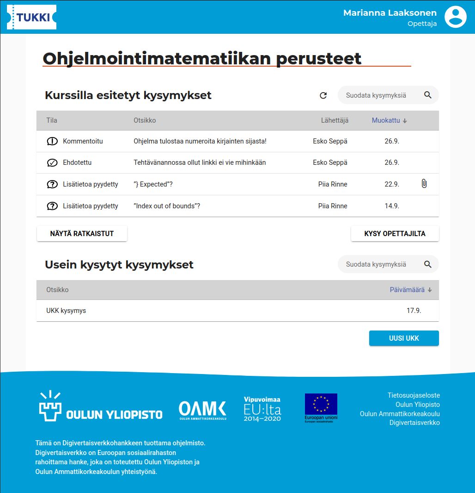
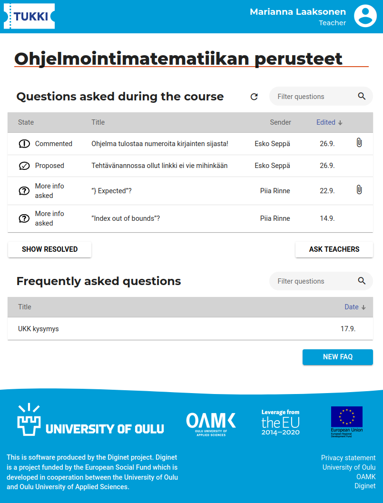
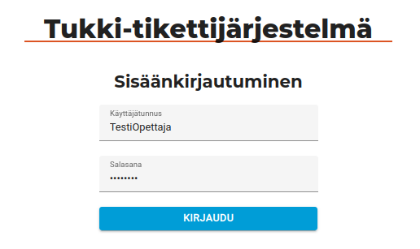
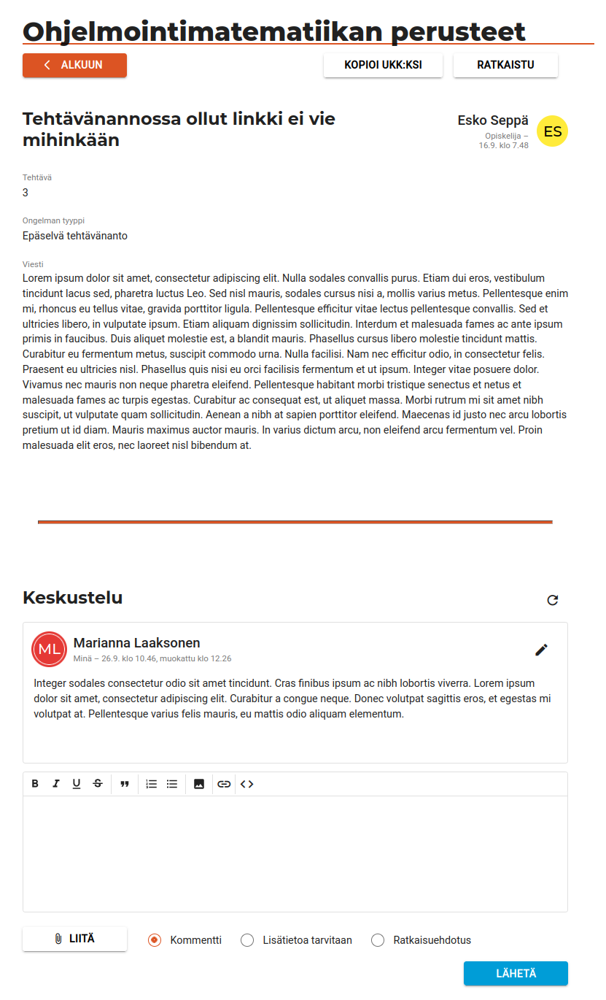
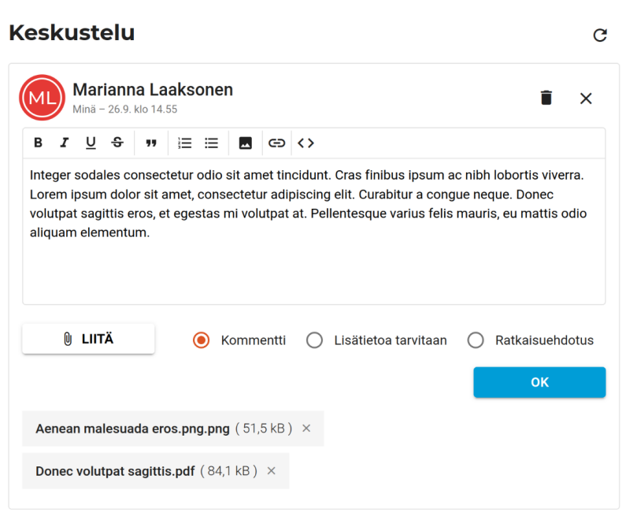

# Tukki-tikettijärjestelmän frontend

[English version of this document](README-en.md)

Tämä on Digivertaisverkkohanketta varten toteutetun opetuskäyttöön tarkoitetun Tukki-tikettijärjestelmän frontend. Se on toteutettu [Angularilla](https://angular.io/). Tekemäni tekninen dokumentaatio ja arkkitehtuurin kuvaus löytyy tiedostossa
[documentation/kuvaus/description.md](documentation/kuvaus/description.md). Compodocilla luotua teknistä dokumentaatiolla voi lukea tietostosta [documentation/index.html](documentation/index.html).

Ensin on hyvä eritellä, mitä osa-alueita olin tekemässä projektissa ja mitkä olivat toisten tekemiä:

## Osa-alueet, joita olen tehnyt frontendin osalta

- Frontend-arkkitehtuuri.
- Suuren osan toteutuksesta.
- Tekninen dokumentaatio.
- Lähes kaikki yksikkötestit.

## Muiden tiimiläisten tekemää

- Sovelluksen toiminnallisuus- ja käyttöliittymäsuunnittelu.
- Osia frontendista: Rich text editori, UKK:n tekeminen kysymyksestä, profiilinäkymä, kysymys-näkymien lisäkentät, tietosuojaselosteen sisältö.

## Toteutuksen esittely

Kysymysten listaus on sovelluksen päänäkymä. Tässä näkymä käytettynä Moodle-upotuksen ulkopuolella. Opettajan roolilla kirjautuneena näkyvät kaikki kurssilla opettajille esitetyt kysymykset. Taulukko on tehty Angular Material -kirjastoa hyödyntäen. Rivit voi järjestää eri sarakkeiden mukaan ja niitä voi suodattaa eri kysymysten sisältämien tietojen mukaan. Taulukon sisältö päivittyy ajanjakson välein tai manuaalisesti.

Sovelluksessa käytetyn kielen voi vaihtaa englanniksi.

Järjestelmään voi kirjautua manuaalisesti tunnuksella ja salasanalla, kun sitä käytetään Moodle-upotuksen ulkopuolella.

Yksittäisen kysymyksen näkymässä käyttäjä voi tarkastella kysymyksen tietoja. Opettaja voi asettaa kysymyksen ratkaistuksi ja kysymyksen lähettäjä voi poistaa tai muokata sitä. Opettajat ja opiskelija voivat lisätä kysymykseen kommentteja, jotka näkyvät kysymyksen alla. Käyttäjät voivat muokata omia kommenttejaan.

Kysymyksen ja kommentin yhteydessä näkyy lähettäjän nimi, rooli, avatar-ikoni ja kommentin lähettämis- ja muokkaamispäivämäärä.

Kommenttia muokatessa sen voi poistaa, muuttaa kommentin tai tekstin tilaa sekä lisätä tai poistaa liitteitä. Liite-komponentin olen tehnyt itse.

Tiedostoja lähetetään yhtäaikaisesti ja niiden lähetyksen lähetyksen tila päivitetään edistymispalkeilla. Tässä on käytetty RxJS -kirjastoa.

Kurssilla olevata opettajat voivat muuttaa kurssin asetuksia, ladata ja lisätä usein kysyttyjä kysymyksiä sekä kurssin asetuksia ja kutstua ulkopuolisia osallistumaan kurssille. Lisäkenttien editointi-ikonia valitsemalla avautuu niiden muokkausnäkymä.

Lisäkenttien muokkausnäkymä. Monivalintojen lisääminen on toteutettu Angular Materialin chipseillä.